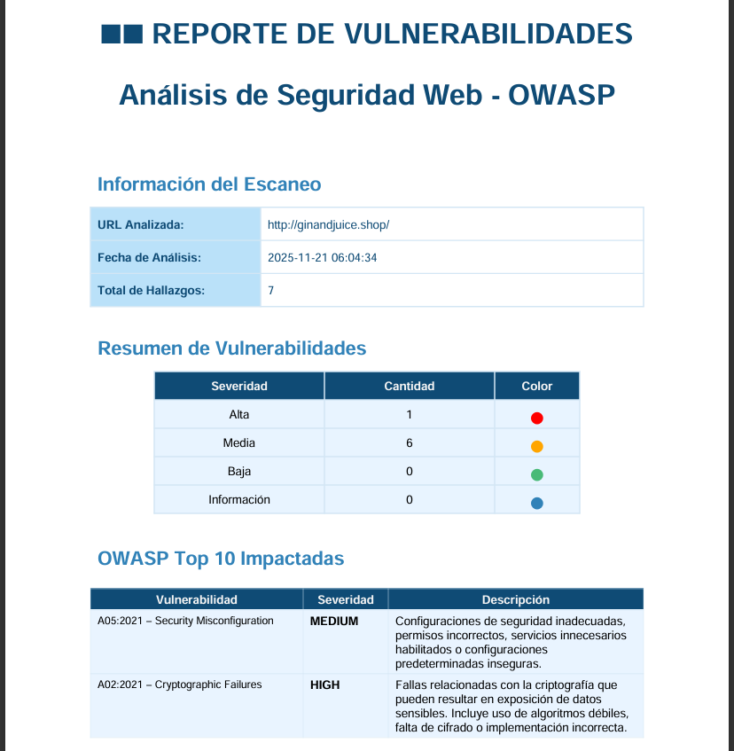
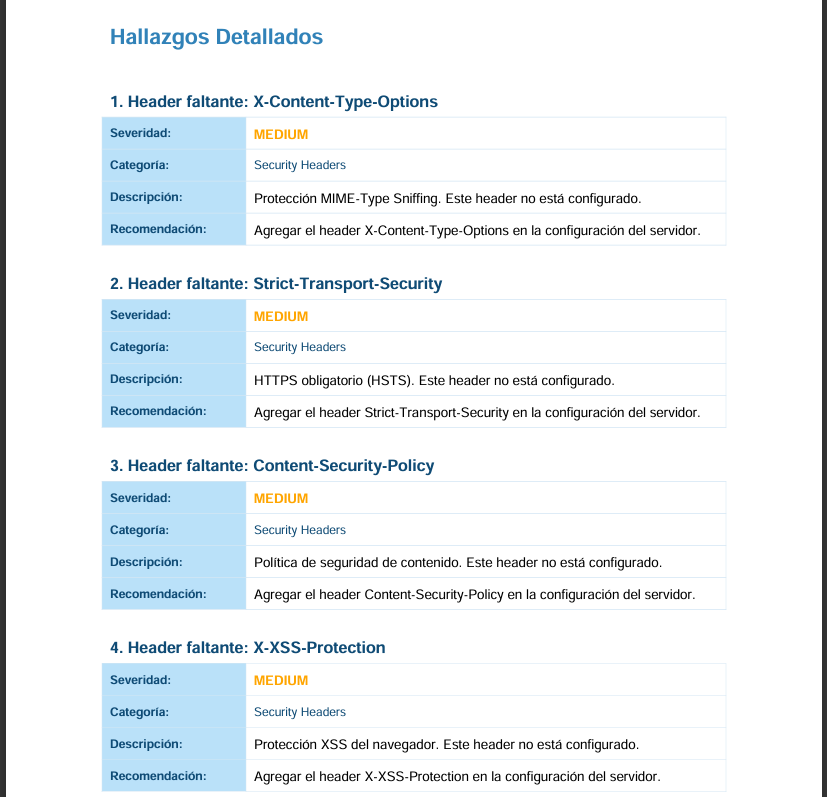

# OWASP Vulnerability Scanner

Aplicación web educativa basada en Flask que replica un flujo básico de auditoría OWASP: analiza cabeceras, configuración SSL/TLS, cookies, métodos HTTP y expone un escaneo de puertos/servicios vía `python-nmap`. Todo queda documentado en un PDF de alta fidelidad con resumen de severidades, mapeo a OWASP Top 10 y hallazgos detallados.

<p align="center">
  
</p>

<p align="center">
  
</p>

<p align="center">
  
</p>

> **Importante:** usa este proyecto únicamente en entornos controlados y con permiso del propietario del dominio/host. Está pensado para fines académicos y de laboratorio.

---

## ✨ Características principales

- **Escaneo web rápido**: validación de cabeceras de seguridad, políticas HTTPS/HSTS, atributos de cookies y métodos HTTP permitidos.
- **Verificación SSL/TLS**: inspección del certificado, protocolo negociado y recomendaciones según mejores prácticas.
- **Detección de servicios con Nmap**: `python-nmap` ejecuta `-sV --top-ports 100` para identificar servicios expuestos y clasificarlos por severidad.
- **Reportes PDF profesionales**: resumen visual, lista de vulnerabilidades OWASP impactadas y hallazgos paginados con descripciones y recomendaciones.

---

## 🧱 Stack & componentes

- **Backend**: Python 3.11+, Flask, `requests`, `urllib3`, `python-nmap`.
- **Reportes**: ReportLab para maquetar PDF personalizados.
- **Frontend**: HTML + CSS (sin framework) + JS vanilla para consumir `/api/scan`.

---

## 📦 Requisitos previos

- Python 3.11 o superior.
- `pip` y `venv`.
- [Nmap](https://nmap.org/download.html) instalado y accesible desde la línea de comandos (`nmap -v`). `python-nmap` es solo un wrapper; sin el binario de Nmap no se ejecutará el escaneo de puertos.
- (Opcional) Virtualenv o conda para aislar dependencias.

---

## 🚀 Instalación rápida

```bash
# 1. Clonar el repositorio
git clone https://github.com/JoseAlberto13/Scanner-de-Vulnerabilidades-OWASP.git

# 2. Crear y activar un entorno virtual (Windows PowerShell)
python -m venv .venv
.venv\Scripts\Activate.ps1

# En Linux/macOS:
# python -m venv .venv
# source .venv/bin/activate

# 3. Instalar dependencias
pip install --upgrade pip
pip install -r requirements.txt
```

Confirma que `nmap` está disponible:

```bash
nmap -v
# Nmap version 7.94SVN ( o similar )
```

---

## ▶️ Ejecución

```bash
# Desde la raíz del proyecto (con el entorno activado)
python app.py
```

Luego abre `http://localhost:5000` en tu navegador:

1. Ingresa una URL con o sin esquema (`https://` se agrega automáticamente si falta).
2. Descarga el reporte PDF generado con el botón “📄 Ver Reporte Completo”.

Todos los PDF quedan almacenados en `reports/` con timestamp (`reporte_YYYYMMDD_HHMMSS.pdf`).

---

## 📡 Endpoints principales

| Método | Ruta               | Descripción                                             |
| ------ | ------------------ | ------------------------------------------------------- |
| POST   | `/api/scan`        | Lanza el escaneo contra la URL enviada en JSON (`url`). |
| GET    | `/api/report/<id>` | Devuelve el PDF generado (stream).                      |
| GET    | `/api/reports`     | Lista histórica de reportes disponibles.                |

---

## 📝 Estructura del proyecto

```
.
├── app.py                  # Servidor Flask y endpoints
├── scanner.py              # Lógica de escaneo (web + Nmap)
├── pdf_generator.py        # Generación del reporte en PDF
├── config.py               # Parámetros globales y OWASP Top 10
├── templates/
│   └── index.html          # UI principal
├── static/
│   ├── css/styles.css      # Estilos con la nueva paleta
│   └── js/main.js          # Interacciones cliente
├── reports/                # Salida de los PDF
└── docs/screenshots/       # Imágenes SVG usadas en este README
```

---

## ❗ Buenas prácticas y límites

- Sólo ejecutar contra dominios/hosts donde tengas autorización explícita.
- Respeta políticas de uso aceptable (ToS) y regulaciones locales.
- Los resultados son heurísticos; no reemplazan una auditoría profesional.

---

## 📄 Licencia

Este proyecto está bajo la licencia **MIT** (ver `LICENSE`). Si lo usas en clases o laboratorios, mantén el aviso de copyright.
